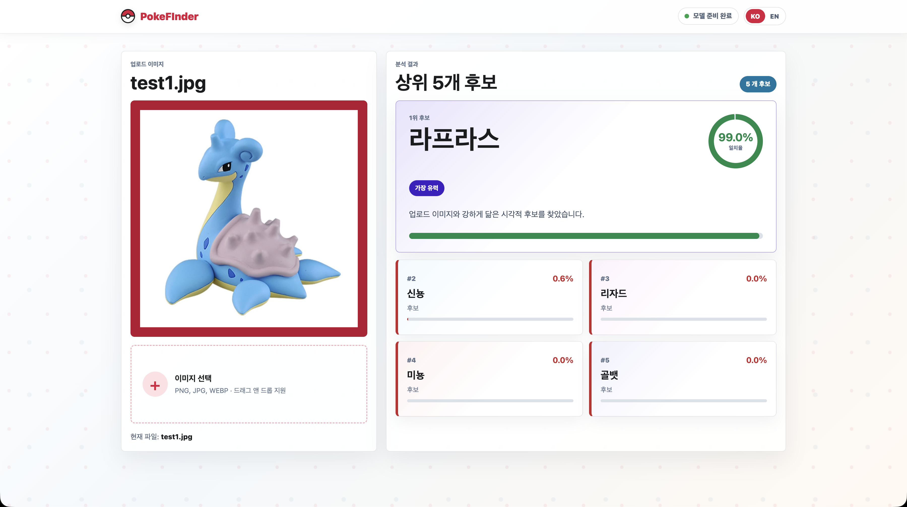

# PokeFinder

포켓몬 이미지를 업로드하면 브라우저에서 직접 포켓몬을 분류하는 Client-side ML 서비스입니다. 이미지는 서버로 업로드하지 않고, 정적 파일로 배포된 ONNX 모델을 사용해 사용자의 브라우저 안에서 추론합니다.

## 배포 사이트

GitHub Pages 배포 주소:

https://beeean17.github.io/PokeFinder/

## 실행 화면



## 프로젝트 개요

PokeFinder는 Python으로 포켓몬 이미지 분류 모델을 학습하고, 학습된 모델을 ONNX로 변환한 뒤 React 웹앱에서 실행하는 구조입니다.

기본 흐름은 다음과 같습니다.

```text
PokemonData/
→ 데이터 인덱스 생성
→ EfficientNet-B0 Transfer Learning
→ ONNX 모델 변환
→ React + ONNX Runtime Web
→ GitHub Pages 정적 배포
```

브라우저 앱은 사용자가 선택한 이미지를 Canvas에서 전처리하고, `onnxruntime-web`으로 모델을 실행합니다. 별도 백엔드 서버, 이미지 업로드 API, 추론 서버는 사용하지 않습니다.

## 주요 코드 구조

```text
prepare_data.py        # PokemonData 폴더를 읽어 학습/검증 데이터 인덱스 생성
train.py               # EfficientNet-B0 기반 포켓몬 분류 모델 학습
predict.py             # PyTorch 또는 ONNX 모델로 로컬 이미지 예측
export_onnx.py         # 학습된 PyTorch checkpoint를 ONNX 모델로 변환
console_report.py      # 데이터셋, 학습 결과, 예측 결과 요약 출력

src/App.jsx            # React UI
src/ml/preprocess.js   # 브라우저 이미지 전처리
src/ml/predict.js      # ONNX Runtime Web 모델 로드 및 추론
src/styles.css         # 화면 스타일

public/models/         # 브라우저에서 불러오는 ONNX 모델과 labels
public/sample/         # 샘플 이미지
docs/                  # 아키텍처 보고서
```

## 모델 학습 방향

처음에는 EfficientNet-B0를 기반으로 Transfer Learning을 적용했습니다. 포켓몬 분류는 처음부터 CNN을 학습하기보다 ImageNet으로 사전 학습된 backbone을 사용하는 편이 데이터 효율과 정확도 면에서 유리합니다.

초기 baseline은 backbone을 고정한 상태에서 classifier head 중심으로 학습했습니다.

```text
validation top-1: 77.81%
validation top-5: 92.14%
checkpoint size: about 6.6 MB
```

이후에는 정확도를 높이기 위해 EfficientNet-B0 전체 backbone을 fine-tuning하는 방향으로 바꿨습니다.

```bash
.venv/bin/python train.py --epochs 20 --batch-size 32 --lr 5e-5
```

CUDA 환경에서는 다음처럼 실행할 수 있습니다.

```bash
.venv/bin/python train.py --epochs 20 --batch-size 32 --lr 5e-5 --device cuda
```

## Crop 기반 개선

사용자가 업로드하는 이미지는 항상 포켓몬 전체가 깔끔하게 보이지 않습니다. 얼굴만 보이거나, 몸 일부만 보이거나, 배경이 복잡한 경우가 있습니다.

그래서 학습 이미지를 하나의 방식으로만 전처리하지 않고, 다음 세 가지 view를 섞어서 학습하도록 개선했습니다.

```text
50% full image
30% object-centered crop
20% feature-centered crop
```

각 view의 목적은 다음과 같습니다.

| View | 목적 |
|---|---|
| Full image | 전체 실루엣, 꼬리, 귀, 등껍질처럼 전신 특징 보존 |
| Object-centered crop | 배경 영향을 줄이고 포켓몬 중심부 특징 강화 |
| Feature-centered crop | 얼굴 또는 상단 특징처럼 부분 이미지에 대한 대응력 강화 |

포켓몬은 사람 얼굴처럼 일정한 얼굴 구조를 갖지 않기 때문에, 얼굴만 따로 학습하는 방식은 위험할 수 있습니다. 피카츄의 귀, 꼬부기의 등껍질, 파이리의 꼬리처럼 얼굴이 아닌 특징이 분류에 중요할 수 있기 때문입니다.

따라서 이 프로젝트에서는 “얼굴만 보는 모델”이 아니라 “전체 이미지와 부분 특징을 함께 보는 모델”을 목표로 했습니다.

## Multi-crop 추론

브라우저와 Python CLI 추론도 crop 전략을 반영합니다. 하나의 이미지를 다음 세 가지 view로 전처리한 뒤, 각 view의 logits를 평균내 최종 예측을 만듭니다.

```text
full image logits
object crop logits
feature crop logits
→ average logits
→ softmax
→ top-k predictions
```

관련 구현은 다음 파일에 있습니다.

```text
predict.py
src/ml/preprocess.js
src/ml/predict.js
```

기존 full-image-only 추론과 비교하고 싶다면 `--single-view` 옵션을 사용할 수 있습니다.

```bash
.venv/bin/python predict.py test/test1.jpg --engine torch --top-k 5
.venv/bin/python predict.py test/test1.jpg --engine torch --top-k 5 --single-view
```

## 학습 및 변환 명령어

데이터 인덱스를 생성합니다.

```bash
.venv/bin/python prepare_data.py
```

현재 데이터셋과 학습 결과를 확인합니다.

```bash
.venv/bin/python console_report.py
```

모델을 학습합니다.

```bash
.venv/bin/python train.py --epochs 20 --batch-size 32 --lr 5e-5
```

부분 이미지 대응을 더 강화하고 싶다면 세 확률의 합이 `1.0`이 되도록 조정할 수 있습니다.

```bash
.venv/bin/python train.py --epochs 20 --batch-size 32 --lr 5e-5 \
  --full-image-probability 0.45 \
  --object-crop-probability 0.30 \
  --feature-crop-probability 0.25
```

학습된 모델을 ONNX로 변환합니다.

```bash
.venv/bin/python export_onnx.py --smoke-image test/test1.jpg
```

변환된 모델을 React 앱에서 사용할 수 있도록 복사합니다.

```bash
cp artifacts/pokemon-efficientnet-b0-fp32.onnx public/models/pokemon-efficientnet-b0-fp32.onnx
cp artifacts/labels.v1.json public/models/labels.v1.json
```

## 웹앱 실행

의존성을 설치합니다.

```bash
npm install
```

로컬 개발 서버를 실행합니다.

```bash
npm run dev
```

빌드를 확인합니다.

```bash
npm run build
```

GitHub Pages용 base path로 빌드하려면 다음 명령어를 사용합니다.

```bash
npm run build:pages
```

## 정확도 비교 방식

Crop 기반 개선은 모든 이미지에서 정확도 향상을 보장하는 방식은 아닙니다. 특히 검증 데이터가 대부분 포켓몬 전체가 잘 보이는 이미지라면, full image 기준 top-1 정확도는 비슷하거나 약간 낮아질 수도 있습니다.

대신 이 방식의 목적은 다음 상황에서 더 안정적인 예측을 만드는 것입니다.

```text
포켓몬 일부만 보이는 이미지
얼굴 또는 상단 특징만 보이는 이미지
배경이 복잡한 이미지
중앙에 포켓몬이 작게 잡힌 이미지
```

따라서 모델 개선 여부는 다음 두 조건을 비교해 판단하는 것이 좋습니다.

```text
1. 기존 single-view 모델의 validation top-1 / top-5
2. crop 학습 + multi-crop 추론 모델의 validation top-1 / top-5
```

추가로 실제 사용자가 업로드할 법한 부분 이미지 테스트셋을 따로 만들어 비교하면 더 정확하게 판단할 수 있습니다.

## 배포 구조

이 프로젝트는 GitHub Pages에 정적 사이트로 배포할 수 있습니다.

```text
React build output
→ dist/
→ GitHub Pages
→ browser loads ONNX model from public/models
→ local client-side inference
```

서버에서 이미지를 저장하거나 추론하지 않기 때문에, 서버 비용이 거의 없고 사용자의 이미지가 외부 서버로 전송되지 않는다는 장점이 있습니다.
